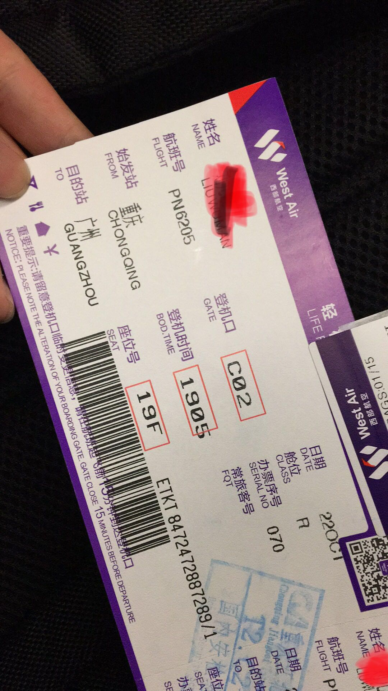
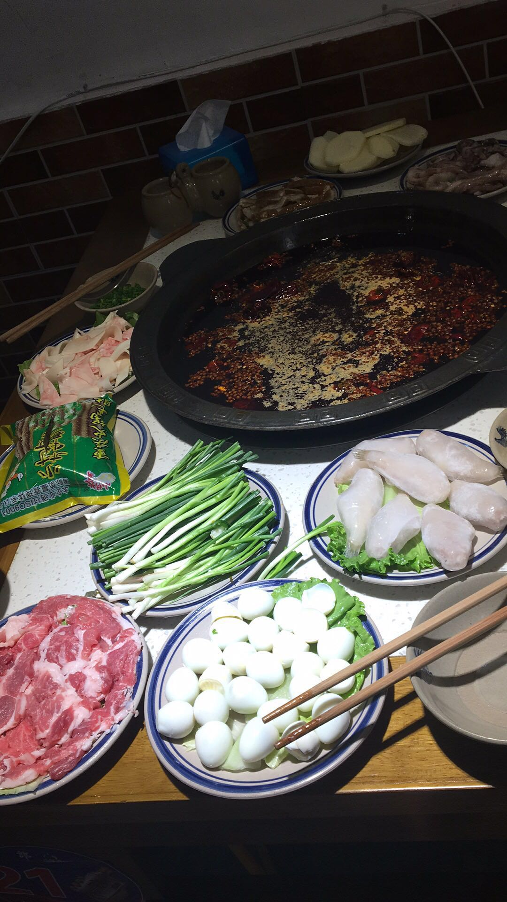


  
  


毕业两年了，突然想去弄个博客（不是纯技术博客），这两年的经历了太多事情，有太多的感触，就想来偶尔记录下生活和分享技术笔记,也让自己有一个可以追忆的地方吧。

其实写这个博客的开始突然一瞬间很难受，平时因为工作忙到没时间没心思去回想过往，突然回头望一眼，万千思绪涌上心头，不知不觉，我的生命流逝了二十几个年头，我也成了奔三的人儿，但是我怎么感觉我才毕业！！！我们这代人已经在慢慢的组建自己的家庭，慢慢的在承受我们这个年纪应该属于自己的帅气和压力，慢慢的青春马上就要划上了句号。  

回想刚当广州的第一个年头，某一个晚上我就突然打电话给家里我要去广州了，爸妈毅然的支持让我很感动，说男儿志在四方，但在外一定要好好保重身体。可能于对于父母而言，孩子是否优秀没那么重要，最重要的是平安健康开心。但是这是我的选择，人生其实就是在不停的做选择，他们尊重了我的选择，还义无反顾的支持，我很感激。其实去广州我自己是很慌的，因为我真的一无所知，一无所有，但是我就是不甘心，人呢总是要经历了才会成长，这可能就是不见棺材不掉泪吧。自己也是个菜鸡，但是我必须去，我知道如果想做出改变，我就必须给自己的人生加个难度，我跟好兄弟告别之后，背上我的电脑包拖着行李箱，去到了机场，坐在机场时有很多的不舍，舍不得在家的爸妈，舍不得一群好兄弟，舍不得我已经放弃的东西，可能这就是现实吧，我都必须得坦然面对。在飞机起飞后，我俯瞰着这座城市，俯瞰着我全部的青春，全部的感情，全部的羁绊时我偷偷的抹掉眼泪，我即将开启新的征程，虽然平凡的我，但我的征程也可以是星辰大海。  

广州的故事就这么开始了。

