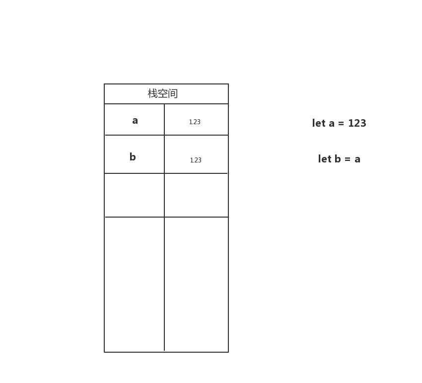
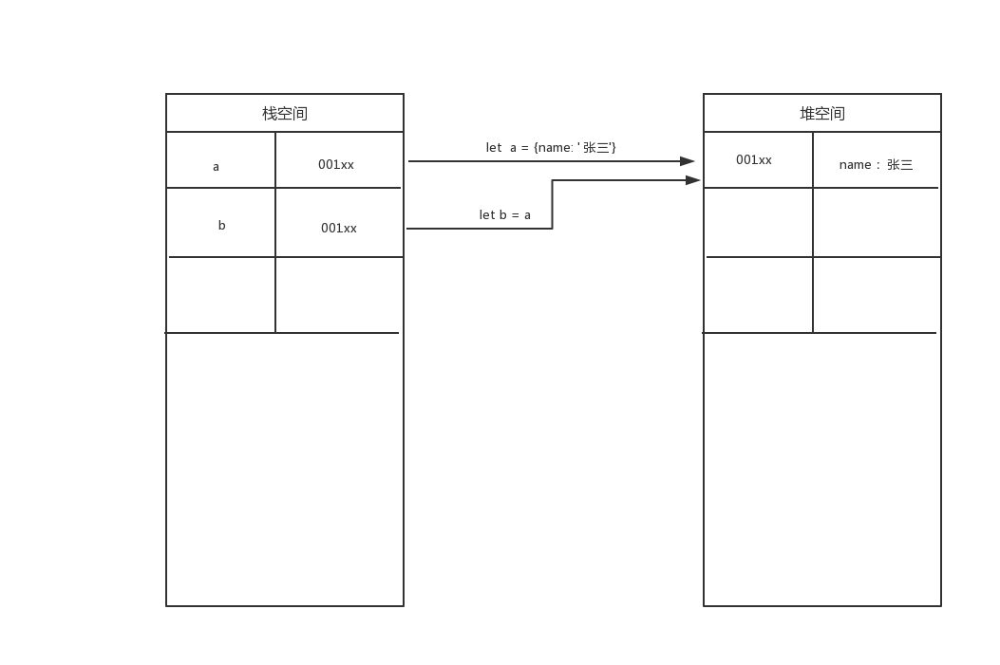

## 1. js的数据类型

- 基本数据类型（值类型）
```
Number String Boolean undefined null Symbol
```
- 复杂数据类型（引用类型）
```
Object Array Function
```

## 2. 值类型的理解
- 值类型是按值访问
```
let a = '123'
let b = a
a = '234'
console.log(a,b) // '234','123'
```

  **这里将a变量的值赋值123，代表在栈空间里分配了一个内存空间，b = a,代表赋值了在栈空间又分配了一个内存给b,将a变量的值赋值给b，a和b互不影响**
- 值类型是保存在栈空间
  


## 3. 引用类型的理解
- 引用类型是按引用访问
```
let a = {name:'张三'}
let b = a
a.name = '李四'
console.log(a,b) // '李四','李四'
```
  **这里定义了一个对象，a变量里保存了指向了这个对象的指针（也就是这个对象在堆空间里的内存地址）b = a,表示b变量里也保存了指向这个对象的指针，a和b同时指向这个对象，其中一个修改了这个对象，最终的结果都会变，a和b相互影响**
- 引用类型的变量标识符是保存在栈空间，堆内存中保存对象的指针（也就是指定对象的地址）
  


## 4. 值类型和引用类型的区别
- 基本类型的值一经确定是不可改变
- 引用类型的值是动态的
- 基本类型的值只保存在栈空间里，包括变量名和变量值；引用类型的值同时保存在栈和堆的空间里，包括变量名，只想对象的指针（对象的地址），堆中的对象
- 基本类型的比较是值的比较，引用类型的比较是指针的比较


